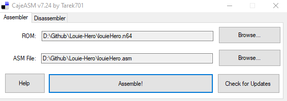

# Louie-Hero
A ROM hack for Bomberman Hero which exclusively features Louie

# Requirements
In order to play the ROM you'll need a clean copy of Bomberman Hero (JP only right now), and CajeASM. You can get CajeASM [here](https://www.romhacking.net/utilities/1085/). I can't link to where you can get a JP ROM for Bomberman Hero, but I believe in your abilities to find one.

# How to generate it
Once you have CajeASM installed, launch the GUI and specify the path of your clean Bomberman Hero ROM and the ASM included in this repository. Click assemble and you're all set.

# Known Issues
There are some levels which currently cannot be completed with Louie:
- Magma Dam (Exit 1, can take Exit 2)
- Hyper Room (Can take heavy room exit, secret room exit is unreachable)
- Secret Room

There are several levels which had to be heavily modified so they can be completed with Louie:
- Move Stone
  - Forced beam to spawn on level start becaause Louie can't move the blocks
- Hades Crater
  - Removed the door since Louie will fall and can't destroy the pillars
- Death Temple
  - Removed the cage door since hitting the switch with a bomb is required to open it
- Aqua Tank
  - Added beam to end level since Louie cannot destroy the tank
- Aquaway
  - Added a box at the end of the level so Louie can reach the exit
- Heaven Sky
  - Replaced the mini boss with a level exit beam since Louie can't deal damage to the boss
- Mirror Room
  - Removed mirror bomber because with Louie it crashes the game
  - Removed mirror doors because hitting a switch with a bomb is required to open them
- Rockn' Road
  - Changed starting position to after the warp since Louie cannot take the warps currently
- Warp Room
  - Again, changed starting position to after the warp since Louie can't take warps
- Bubble Hole
  - Added beam so level can be completed
- Hard Coaster
  - Added box bridge to the pit so Louie can get across since coasters don't work
  - Forced player to have all four crystal shards on level start so the exit door opens
- Mad Coaster
  - Added beam at the start of the level since coasters don't work
- Float Zone
  - Added a bunch of boxes to form stairs to climb up the level since the bubble powerup doesn't work with Louie
  - Removed the rising platform that blocked the last opening since the switch can't be hit with Louie
  - Raised the final spiked platform to be level with the exit so Louie can exit the stage
 
Various other known issues:
- Bouncy terrain in Bubble Hole crashes the game when touched
- Water doesn't damage Louie
- Can't activate coasters in Secret Room, Hard Coaster, or Mad Coaster
- Can't activate switches
- Reflection in Mirror Room crashes the game if present

I baked in debug mode for now so people can mess around with it and just skip the unbeatable levels, but currently working on fixing those issues

# Special Thanks
- Thanks to CedarBranch for their help with removing the Bomberman model from Louie's back and fixing the crash on entering the exit beam in Move Stone
- Thanks to .Coockie and everyone in the BomberHack server for help with N64 ASM hacking in general

# Questions
If you have questions or need help generating the ROM, you can contact me directly  
Discord Beck64
